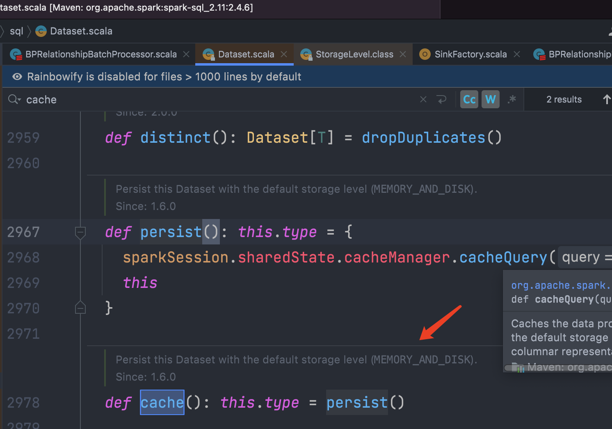
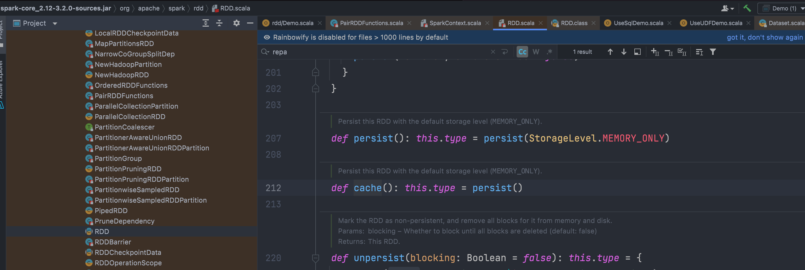

rdd

```


rdd在默认情况下 并不是一直在内存中的 如果内存中已经存放过多的rdd 那在生成新的rdd时，会移除掉最不经常使用的rdd，以便加入新的rdd

如果需要多次用到rdd  那么可以手动缓存rdd

persist与cache

调用persist与cache后  rdd会被标记为待缓存状态  此时并未真的被缓存  直到执行action操作

unpersist方法会清除缓存标记  并立刻释放缓存
```





checkpoint
